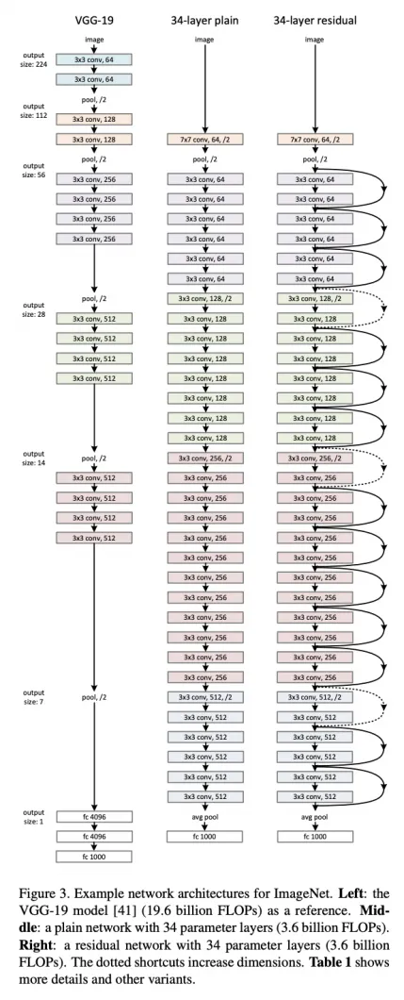

<h1 align="center">Transfer learning</h1> 
Training a Convolutional Neural Network from scratch requires a huge amount of data to train the network and amount of time for training to take place.

Transfer learning is a technique that allows us to use a `model trained` for a `certain task` as a starting point for a machine learning model for a different task.

Simply, remove the `Fully Connected layer head` from the pre-trained network (last layer) and replace it with a `softmax classifier`. This method is super simple as it allows us to treat the pre-trained CNN as a `feature extractor` and then pass those features through a Logistic Regression `classifier`.

**Data:**
- [Cats vs. Dogs](https://www.kaggle.com/biaiscience/dogs-vs-cats?select=train) Dataset.
- One file containes 25,880 images.
- Only two classes (Cat&Dog)
- Images with variable size.

**Transfer Learning Steps:**
- Taking a pre-trained CNN model (Typically on the ImageNet dataset).
- Removing the FC layer head from the CNN.
- Treating the output of the body of the network as an arbitrary feature extractor with spatial dimensions M × N × C.

I'm going to use the pre-trained [Resnet](https://arxiv.org/abs/1512.03385)

